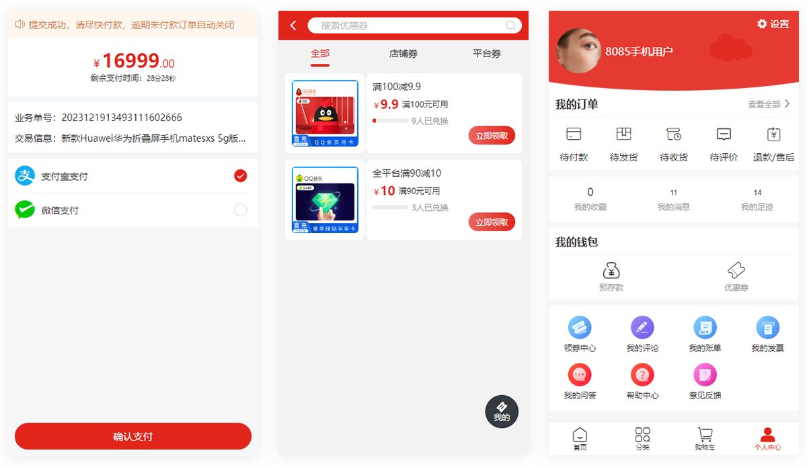
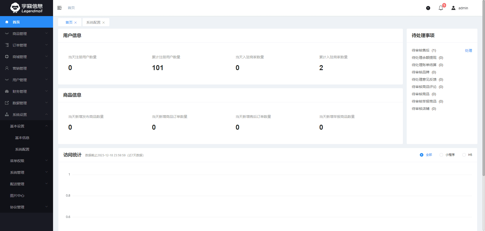

[comment]: <> (<p align="center"></p>)


<h2 align="center">Legend 企业级开源商城系统</h2>
<h4 align="center">全新升级 &nbsp; | &nbsp;  SpringBoot3.1.x  &nbsp; | &nbsp;  JDK17 &nbsp; | &nbsp; 全新Spring Cloud版本</h4>
<h4 align="center">基于 Spring Authorization Server 全新适配 OAuth 2.1 协议的企业级微服务架构</h4>

---

<p align="center">
    <a href="https://spring.io/projects/spring" target="_blank"></a>
    <a href="https://spring.io/projects/spring-boot" target="_blank"></a>
    <a href="https://spring.io/projects/spring-cloud" target="_blank"></a>
    <a href="https://github.com/spring-projects/spring-authorization-server" target="_blank"></a>
    <a href="https://github.com/alibaba/spring-cloud-alibaba" target="_blank"></a>
    <a href="https://nacos.io/zh-cn/index.html" target="_blank"></a>
</p>
<p align="center">
    <a href="https://bell-sw.com/pages/downloads/#downloads" target="_blank"></a>
    <a href="./LICENSE"></a>
    <a href="https://www.legendshop.cn"></a>
    <a href="https://gitee.com/legendmall/legend-cloud"></a>)
    <a href="https://gitee.com/legendmall/legend-cloud"></a>
</p>
<p align="center">
    <a href="https://github.com/legendmall/legend-cloud">Github 仓库</a> &nbsp; | &nbsp;
    <a href="https://gitee.com/legendmall/legend-cloud">Gitee 仓库</a> &nbsp; | &nbsp;&nbsp;
    <a href="https://gitee.com/legendmall/legend-cloud.wiki.git">wiki文档</a>
</p>

<h3 align="center"> 如果您觉得有帮助，请点右上角 "Star" 支持一下，谢谢！</h3>

---

## 企业级微服务架构电商系统

Legend Cloud 是一款企业级微服务架构电商系统，全面拥抱Spring全家桶，基于Spring 6.0.13 、Spring Boot 3.1.5、Spring Cloud 2022.0.4、Spring Authorization Server 1.1.3、Spring Cloud Alibaba 2022.0.0.0、Nacos 2.2.1 等主流技术栈开发的B2B2C电商系统，遵循SpringBoot 编程思想，高度模块化和可配置化。具备服务发现、配置、熔断、限流、降级、监控、多级缓存、分布式事务、等功能。


## 总体架构


## 启动文档
- <a href="https://gitee.com/legendmall/legend-cloud/wikis/pages/preview?sort_id=9258245&doc_id=4914160"> 快速启动（后端项目） </a>

## 演示地址
- 商城后台管理：https://mall-admin.legendshop.cn/
- 商城商家端：https://mall-shop.legendshop.cn/
- 以下为微信H5端、小程序、公众号（扫码获取平台端、商家端体验账号）

   
-
> 部分功能演示视图，正在添加中

- 用户端截图
  
  
  


- 平台端演示截图

  


- 商家端演示截图
  
## 功能版本介绍

<a href="https://code.legendshop.cn">详情见官方网站>>>>>>></a>

## 技术栈和版本说明

### Spring系列及核心框架/工具版本

| 组件                          | 版本              |
|-----------------------------|-----------------|
| Spring                      | 6.0.13           |
| Spring Boot                 | 3.1.5           |
| Spring Cloud                | 2022.0.4        |
| Spring Cloud Alibaba        | 2022.0.0.0      |
| Spring Security             | 6.1.4           |
| Spring Authorization Server | 1.1.3           |
| Nacos                       | 2.2.1           |
| Sentinel                    | 1.8.6           |
| Seata                       | 1.7.0           |
| Knife4j                     | 4.3.0           |
| Xxl-Job                     | 2.4.0          |
| Mysql                       | 8.0.17          |
| Elasticsearch               | 8.8.1           |


> Spring Cloud Alibaba 版本对应关系，详见官方：[版本依赖说明](https://github.com/alibaba/spring-cloud-alibaba/wiki/%E7%89%88%E6%9C%AC%E8%AF%B4%E6%98%8E)

### 系统所涉及相关技术

- 持久层框架： Jpa-Plus(Spring Data Jpa & Mybatis Plus,自主研发，聚合两大持久层框架有点并升级，简单易用，可持续优化)
- API 网关：Spring Cloud Gateway
- 服务注册&发现和配置中心: Alibaba Nacos
- 服务消费：Spring Cloud OpenFeign 
- 负载均衡：Spring Cloud Loadbalancer
- 服务熔断&降级&限流：Alibaba Sentinel
- 服务监控：Spring Boot Admin
- 消息队列：默认 RabbitMQ
- 分布式事务：Seata
- 数据缓存：JetCache (Redis + Caffeine) 多级缓存
- 数据库： Postgresql，MySQL，Oracle ...
- JSON 序列化：Jackson & FastJson
- 文件服务：阿里云 OSS / Minio
- 日志中心：ELK
- 日志收集：Logback

## 版本号说明
\(^o^)/~本系统版本号，分为三段
- 第一段，表示重大架构调整本项目开源前已经从1.0迭代到现在7.0版本
- 第二段，表示系统功能的变更（增加）
- 第三段，表示系统功能维护及优化情况

## 工程结构

```
legend-cloud
├── business -- 主要业务服务工程
├    ├── legendshop-auth -- 登录认证服务
├    ├── legendshop-basic -- 系统基础服务
├    ├── legendshop-gateway -- Gateway路由模块
├    ├── legendshop-id -- 分布式ID生成服务
├    ├── legendshop-order -- 订单服务
├    ├── legendshop-product -- 商品服务
├    ├── legendshop-task -- 定时器任务
├    └── legendshop-user  -- 用户服务
├── common -- 系统公共包
├    ├── legendshop-common-core -- 系统基础核心模块
├    ├── legendshop-common-data -- Redis公共集成
├    ├── legendshop-common-datasource -- 数据源公共集成
├    ├── legendshop-common-excel -- Excel导入导出
├    ├── legendshop-common-feign -- Feign Client公共集成
├    ├── legendshop-common-id -- 公共Id服务相关
├    ├── legendshop-common-job -- xxl-job公共集成
├    ├── legendshop-common-log -- 公共日志模块
├    ├── legendshop-common-logistics -- 物流查询集成
├    ├── legendshop-common-monitor -- 服务监控
├    ├── legendshop-common-prometheus -- prometheus集成
├    ├── legendshop-common-rabbitmq -- rabbitmq集成
├    ├── legendshop-common-region -- 地区相关
├    ├── legendshop-common-sentinel -- 熔断降级
├    ├── legendshop-common-service -- 公共接口抽象
├    ├── legendshop-common-sms -- 短信集成
├    ├── legendshop-common-spider -- 爬虫相关
├    ├── legendshop-common-swagger -- 接口文档
├    ├── legendshop-common-validator -- 公共校验
├    ├── legendshop-common-wechat -- 微信相关公共集成
├    ├── legendshop-common-xss -- xss防范
├    └── legendshop-id-core -- 分布式ID生成核心类
├── common-private -- 系统公共包
├    ├── legendshop-common-captcha -- 滑块验证码模块
├    ├── legendshop-common-gateway -- Gateway公共类
├    ├── legendshop-common-oss -- 文件存储模块
├    ├── legendshop-common-security -- Spring Security
└──  └── legendshop-common-util --  公工具类
```

## 相关项目地址

- B2C单体版地址(暂未开源,敬请期待)：[https://gitee.com/legendmall/legend](https://gitee.com/legendmall/legend)
- 前端-平台端工程地址：[https://gitee.com/legendmall/legend-cloud-admin-ui](https://gitee.com/legendmall/legend-cloud-admin-ui)
- 前端-商家端工程地址：[https://gitee.com/legendmall/legend-cloud-shop-ui](https://gitee.com/legendmall/legend-cloud-shop-ui)
- 前端-用户端工程地址：[https://gitee.com/legendmall/legend-cloud-user-ui](https://gitee.com/legendmall/legend-cloud-user-ui)

## 技术解析
> 后续阶段性推出一些企业级验证的技术解析文章，敬请期待

## 授权协议

> 本项目基于 APGL 3.0 开源协议，商业项目请联系授权，并遵守以下补充条款

- 不得将本软件应用于危害国家安全、荣誉和利益的行为，不能以任何形式用于非法为目的的行为。
- 在延伸的代码中（修改现有源代码衍生的代码中）需要带有原来代码中的协议、版权声明和其他原作者 规定需要包含的说明（请尊重原作者的著作权，不要删除或修改文件中的Copyright和@author信息） 更不要，全局替换源代码中的 Legendshop Cloud等字样，否则你将违反本协议条款承担责任。
- 您若套用本软件的一些代码或功能参考，请保留源文件中的版权和作者，需要在您的软件介绍明显位置 说明出处，举例：本软件基于 Legend Cloud 微服务架构，并附带链接：https://www.legendshop.cn
- 任何基于本软件而产生的一切法律纠纷和责任，均于作者无关。
- 如果你对本软件有改进，希望可以贡献给我们，双向奔赴互相成就才是王道。
- 本项目已申请软件著作权，请尊重开源。

## 参与贡献

1. 在 Gitee fork 项目到自己的 repo
2. 把 fork 过去的项目也就是你的项目 clone 到你的本地
3. 修改代码（记得一定要修改 develop 分支）
4. commit 代码，push 到自己的库（develop 分支）
5. 登录 Gitee 在你首页可以看到一个 pull request 按钮，点击它，填写一些说明信息，然后提交即可。
6. 等待维护者合并

## 交流反馈

- Legend Cloud 官网 https://code.legendshop.cn
- Legend Cloud官方技术QQ 1群：96642931
- Legend Cloud官方技术QQ 2群：190339088
- 如需购买商业高级版源码，请联系商务微信

## 特别鸣谢\(^o^)/~\(^o^)/~\(^o^)/~
- [广州朗尊软件科技有限公司](https://www.legendshop.cn)


### 感谢 JetBrains 提供的免费开源 License


